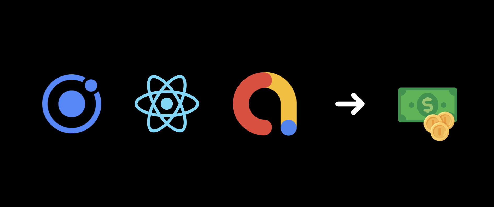

# Monetize Your Ionic React App Using Google AdMob

In this article you will learn how to show different Google AdMob ads in your Ionic React application. 

For this you will use the AdMob plugin that is maintained by the official [Capacitor Community](https://github.com/capacitor-community) GitHub org.

This plugin enables you to use three different ad formats:
- **Banner**: A basic ad format that appears at the top & bottom of the device screen.
- **Interstitial**: Full-page ads appear at natural breaks & transitions, such as level completion. Supports video content.
- **Rewarded**: Ads reward users for watching short videos and interacting with playable ads and surveys. Good for monetizing free-to-play users. Supports video content.

Follow along to see all of them in action.

## Create A New Ionic Project

Use the Ionic CLI to start a new project and check if it works in the browser.

```
ionic start ionic-react-admob-example tabs --type=react
ionic serve
```

## Install And Configure The AdMob Plugin

Install the [Admob Community Plugin](https://github.com/capacitor-community/admob).

```
npm install --save @capacitor-community/admob
```

Add the native iOS project.

```
ionic capacitor add ios
```

Add the following in the `ios/App/App/info.plist` file inside of the outermost `<dict>` and replace [APP_ID] by your AdMob application Id.

```xml
<key>GADIsAdManagerApp</key>
<true/>
<key>GADApplicationIdentifier</key>
<string>[APP_ID]</string>
<key>SKAdNetworkItems</key>
<array>
  <dict>
    <key>SKAdNetworkIdentifier</key>
    <string>cstr6suwn9.skadnetwork</string>
  </dict>
</array>
<key>NSUserTrackingUsageDescription</key>
<string>[Why you use NSUserTracking. ex: This identifier will be used to deliver personalized ads to you.]</string>
```

Add the following code snippet in the `App.tsx` file inside of the `App` function body:

```tsx
useEffect(() => {
  AdMob.initialize({
    requestTrackingAuthorization: true,
  });
}, []);
```

This will initialize AdMob for the entire app.

## Create A Banner Ad

Let's start configuring a banner at the bottom of the app.

Add the following code snippet in the `Tab1.tsx` file inside of the `Tab1` function body:

```tsx
const showBanner = async () => {
  const options: BannerAdOptions = {
    adId: 'ca-app-pub-3940256099942544/2934735716', // demo ad unit id,
    adSize: BannerAdSize.BANNER,
    position: BannerAdPosition.BOTTOM_CENTER,
    isTesting: true,
  };
  await AdMob.showBanner(options);
};
useEffect(() => {
  showBanner();
}, []);
```

This will show the banner as an overlay at the bottom of the page. Be advised to follow [Google's guidelines on ad placement](https://support.google.com/admob/answer/2936217?hl=de&ref_topic=2936214&visit_id=637777030182995119-279234529&rd=1) in a production app.

Hints: 

Do not use a real ad unit id during development to prevent policy violations. Instead, you can get a demo id from Google [here](https://developers.google.com/admob/ios/test-ads).

If you want to use your production ad unit id, you can do so by activating the test mode with `isTesting: true`.

At this point, it's time to build the native iOS project.

```
ionic capacitor build ios
```

Open XCode and run a simulator device to see it in action. It may take a couple of seconds for the ad to appear.


Well done, you've created your first ad!

Obviously, there is more to explore. There are functions to _show_, _hide_, _resume_ and _remove_ the banner and options for the banner _size_ and _position_.

Check out the [full example code](https://github.com/mannabri/ionic-react-admob-example) and try out the different possibilities.

## Create An Interstitial Ad

Simply add the following code snippet in the `Tab2.tsx` file inside of the `Tab2` function body:

```tsx
const showInterstitial = async () => {
  const options: AdOptions = {
    adId: 'ca-app-pub-3940256099942544/4411468910', // demo ad unit id
    isTesting: true,
  };
  await AdMob.prepareInterstitial(options);
  await AdMob.showInterstitial();
};

useEffect(() => {
  showInterstitial();
}, []);
```

This will load a full-page ad which also includes an exit button.


## Create A Reward Video Ad

Simply add the following code snippet in the `Tab3.tsx` file inside of the `Tab3` function body:

```tsx
const showRewardVideo = async () => {
  const options: RewardAdOptions = {
    adId: 'ca-app-pub-3940256099942544/1712485313', // demo ad unit id
    isTesting: true,
  };
  await AdMob.prepareRewardVideoAd(options);
  await AdMob.showRewardVideoAd();
};

useEffect(() => {
  showRewardVideo();
}, []);
```


This will load a full-page ad which also includes an exit button.

## Conclusion

✅ As you can see, it's simple to place different ads with this plugin. I recommend you to put all relevant AdMob code into a separate module in order to keep your code quality high.

⚠️ AdMob provides one more customizable ad format: **native**. It matches the look & feel of your app and can appear inline with app content. This ad format has not yet been implemented by this plugin.

🕵️‍♂️ So far I have not found another plugin, that implements this native format. As I would like to place some inline ads in my next iOS app I am looking for an alternative. **Please leave a comment if you have an idea.**


---

## Tech Stack

- Ionic 6 `"@ionic/react": "^6.0.0"`
- Capacitor 3 `"@capacitor/core": "3.3.4",`
- Official Capacitor Community Plugin Admob. `"@capacitor-community/admob": "^3.2.0",`

## Helpful Links

- [Full Example Code on GitHub](https://github.com/mannabri/ionic-react-admob-example)
- [Ionic Installation](https://ionicframework.com/docs/intro/cli)
- [Official Capacitor Community Plugin for Google AdMob](https://github.com/capacitor-community/admob)
- [Google AdMob Help](https://support.google.com/admob)
- [Google's Guidelines on Ad Placement](https://support.google.com/admob/answer/2936217?hl=de&ref_topic=2936214&visit_id=637777030182995119-279234529&rd=1)