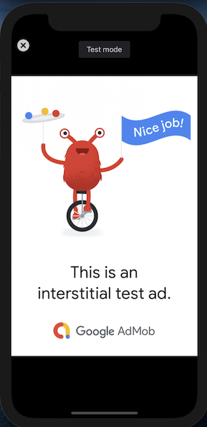

# Monetize Your Ionic React App Using Google Admob

# Content

1. Ionic Project Setup
2. AdMob Plugin Setup
3. Banner Ad
4. Interstitial Ad
5. Reward Video Ad

# 1. Ionic Project Setup

Create a new Ionic project and check if it runs in the browser.

```
ionic start ionic-react-admob-example tabs --type=react
ionic serve
```

Install the [Admob Community Plugin](https://github.com/capacitor-community/admob).

```
npm install --save @capacitor-community/admob
```

Add the native ios project.

```
ionic capacitor add ios
```

# 2. AdMob Plugin Setup

Add the following in the `ios/App/App/info.plist` file inside of the outermost `<dict>`
and replace [APP_ID] by your AdMob application Id.

```xml
<key>GADIsAdManagerApp</key>
<true/>
<key>GADApplicationIdentifier</key>
<string>[APP_ID]</string>
<key>SKAdNetworkItems</key>
<array>
  <dict>
    <key>SKAdNetworkIdentifier</key>
    <string>cstr6suwn9.skadnetwork</string>
  </dict>
</array>
<key>NSUserTrackingUsageDescription</key>
<string>[Why you use NSUserTracking. ex: This identifier will be used to deliver personalized ads to you.]</string>
```

Add the following code snippet in the `App.tsx` file inside of the `App` function body:

```tsx
useEffect(() => {
  AdMob.initialize({
    requestTrackingAuthorization: true,
  });
}, []);
```

This will initialize AdMob for the whole app.

# 3. Banner Ad

Let's start with a minium setup and create a regular banner at the bottom of the app.

Add the following code snippet in the `Tab1.tsx` file inside of the `Tab1` function body:

```tsx
const showBanner = async () => {
  const options: BannerAdOptions = {
    adId: 'ca-app-pub-3940256099942544/2934735716', // demo ad unit id,
    adSize: BannerAdSize.BANNER,
    position: BannerAdPosition.BOTTOM_CENTER,
    isTesting: true,
  };
  await AdMob.showBanner(options);
};
useEffect(() => {
  showBanner();
}, []);
```

This will load a demo banner ad from Google and will show it as an overaly on top of any other app content. In a production app, you should follow [Google's guidelines on ad placement](https://support.google.com/admob/answer/2936217?hl=de&ref_topic=2936214&visit_id=637777030182995119-279234529&rd=1).

**Important**: Do not use a real ad unit id during development! Instead, you can get a demo id from Google [here](https://developers.google.com/admob/ios/test-ads).

At this point, it's time to build the native ios project.

```
ionic capacitor build ios
```

Open XCode and run a simulator device to see it in action. It may take a couple of seconds for the ad to appear.


Well done, you've created your first ad!

Obviously, there is more to explore. There are functions to _show_, _hide_, _resume_ and _remove_ the banner and options for the banner _size_ and _position_.

Get the example app code and try out the different possibilities.

# 4. Interstitial Ad

Simply add the following code snippet in the `Tab2.tsx` file inside of the `Tab2` function body:

```tsx
const showInterstitial = async () => {
  const options: AdOptions = {
    adId: 'ca-app-pub-3940256099942544/4411468910', // demo ad unit id
    isTesting: true,
  };
  await AdMob.prepareInterstitial(options);
  await AdMob.showInterstitial();
};

useEffect(() => {
  showInterstitial();
}, []);
```

This will load a full screen overlay that presents the ad. It also includes a exit button.



# 5. Reward Video Ad

Simply add the following code snippet in the `Tab3.tsx` file inside of the `Tab3` function body:

```tsx
const showRewardVideo = async () => {
  const options: RewardAdOptions = {
    adId: 'ca-app-pub-3940256099942544/1712485313', // demo ad unit id
    isTesting: true,
  };
  await AdMob.prepareRewardVideoAd(options);
  await AdMob.showRewardVideoAd();
};

useEffect(() => {
  showRewardVideo();
}, []);
```


This will load a full screen overlay that presents the ad. It also includes a exit button.
